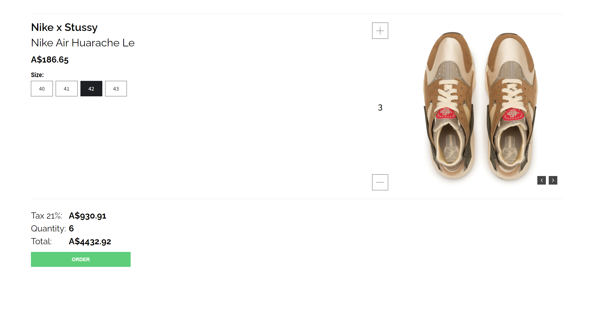
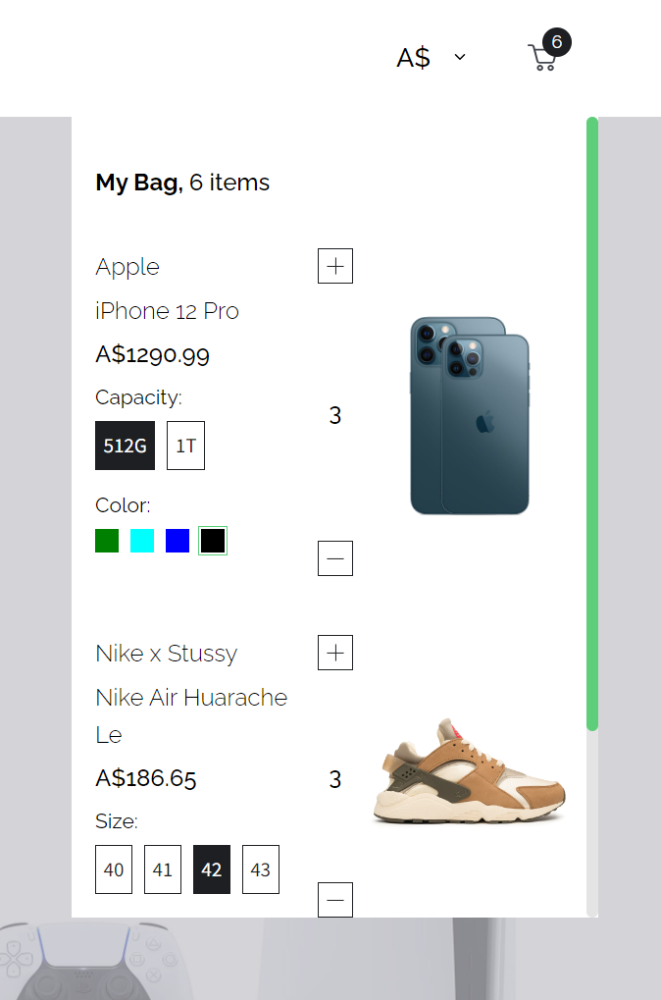

# Cart Application

### Introduction

Welcome to the Cart Application! This repository hosts a React-based frontend and Node.js-based backend to create a comprehensive shopping cart experience. The application provides essential features such as product listing, detailed product descriptions, and a user-friendly cart management system.

### Table of Contents

1. [Installation](installation)
2. [Features](features)
3. Licence

## Installation

1. Clone the repository

```bash
git clone https://github.com/NemanjaDobranic/cart.git
```

2. Install dependencies

Naviagte to the root directory and run:

```bash
npm install
```

3. Start the project

```bash
npm start
```

Frontend server should start on **_http://localhost:3000/_**

4. Navigate to the **_src/server_** directory:

```bash
npm install
```

5. Build the server:

```bash
npm build
```

6. Start the server:

```bash
npm start
```

Backend server should start on **_http://localhost:4000/_**

## Features

- **Product Listing Page (PLP):** Display products categorized for easy navigation.

<p align="center">
    
    
</p>

- **Product Description Page (PDP):** Provide detailed information about individual products.

<p align="center">
    
    
</p>

- **Cart Page + Cart Overlay (Minicart):** Manage added products, adjust quantities, and utilize a convenient minicart overlay.

<p align="center">
    
    
</p>

- **Additional Features:** Various options (attributes) for products and currency change functionality.

<p align="center">
    
</p>

## License

This project is licensed under the [MIT License](https://opensource.org/license/mit/). You are free to use, modify, and distribute it as per the terms of the license.
